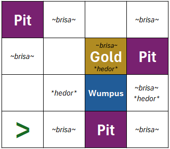
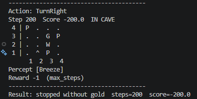
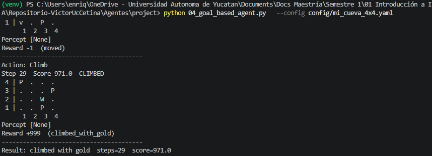
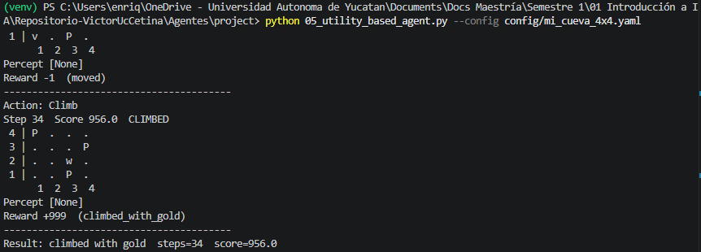
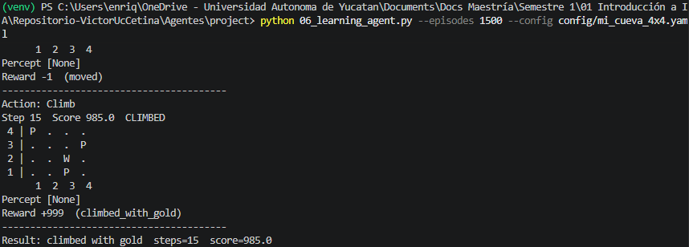

# Ejercicio 1 - World of Wumpus

Acontinuación presento la propuesta de configuración para el juego del Wumpus: 



Usando esta configuración del mundo corremos los diferentes agentes y estos fueron los resultados: 

| Modelo | Resultado | Observaciones |
|:--------- |:-------- | :--------|
| Simple reflex    | Se gastaron los 200 steps y no llegó al oro   | El agente se quedó en varias ocasiones subiendo y bajando por las casillas [2,1]-[2-2], pero no avanzaba más allá. En otras ocasiones se quedaba dando vueltas en [2,1]   |
| Model Based | El agente salió con el oro, le tomó 29 steps y su score fue de 971 | - |
| Goal-based | El agente salió con el oro, le tomó 29 step y su score fue 971 | - |
| Utility-based | El agente salió con el oro, le tomó 34 steps y su score fue 956| Este modelo buscó matar al wumpus, por eso le tomó pasos adicionales |
| Learning | El agente salió con el oro, le tomó 15 steps y obtuvo un score de 985| Mean score (all): 228.5 ; Mean score (last 50): 538.3 | 

Observamos en las pruebas que el mundo creado es adecuado, ya que existe un camino seguro que más de un modelo pudo encontrar. Para este ejemplo el único modelo que no pudo encontrar un camino fue el Simple-Reflex, este tipo de modelos estan basados únicamente es seguir una serie de reglas específicas de cómo actuar en cada situación, en este caso el agente esta configurado para voltear a la izquierda su choca con una pared o voltear a la derecha siempre que detecte peligro (brisa o hedor) por esa razón en todas las situaciones se queda dando vueltas en las casillas que identifica como seguras, solo considera el estado en el que se encuentra sin guardar memoria de por donde ha pasado ni las percepciones que ha tenido con anterioridad en otros puntos del tablero. A diferencias de los otros modelos que sí guardan el historial de su paso por el tablero, aunque cada uno persigue optimizar algo diferente, mantenerse con vida, como explorar hasta encontrar el oro, o maximizar el score obtenido. 


Ahora veamos como cambia el agente Model-based al mover un pit, digamos el [1,4] lo movemos una casilla más cerca de la casilla inicial, el resultado fue el siguiente:
```bash
Action: TurnLeft
Step 200  Score -200.0  IN CAVE
 4 | .  .  .  . 
 3 | P  .  G  P 
 2 | .  .  W  . 
 1 | .  ^  P  . 
      1  2  3  4
Percept [Breeze]
Reward -1  (max_steps)
----------------------------------------
Result: stopped without gold  steps=200  score=-200.0
```
A diferencia del mundo inicialmente creado, el agente no alcanza el oro y termina con sus 200 steps. Este modelo sí guarda un historial de que celdas considera seguras para pasar, aunque al priorizar mantenerse vivo, evitará aventurarse a casillas que no conozca si son seguras o no, en esas situaciones regresará a una casilla segura. Si los "pits" los ponemos más cerca del inicio el agente tendrá menos lugar para explorar por lo que se quedará atorado en una zona o en una casilla que considera como seguras, sin avanzar. 


## Evidencias

### Simple Reflex


### Model-based


### Goal-based


### Utility-based


### Learning
