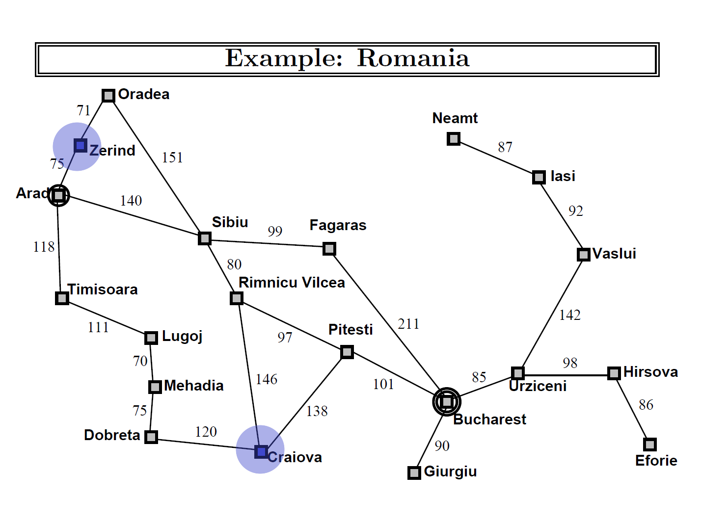
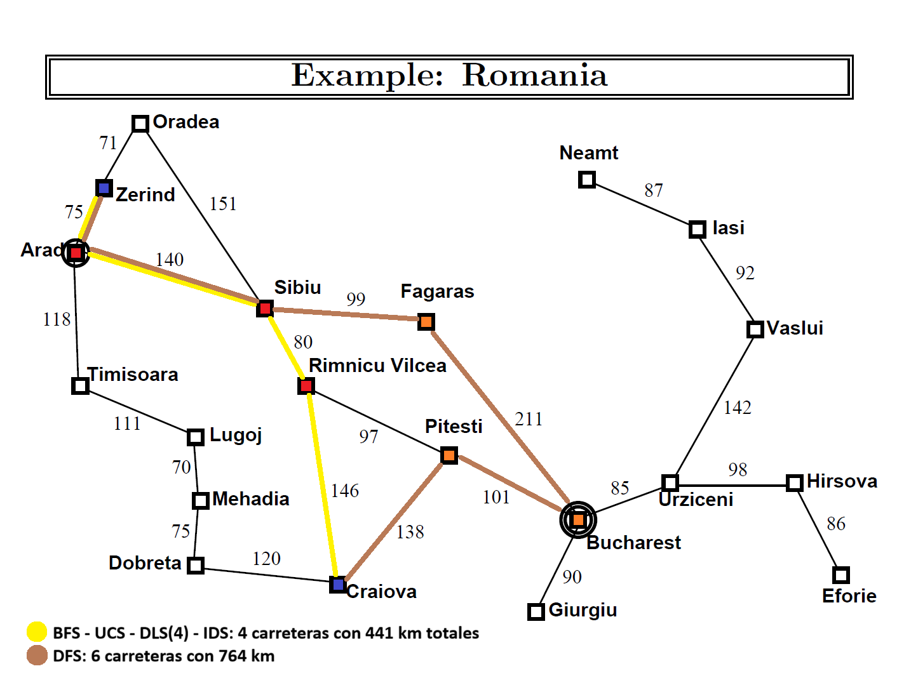
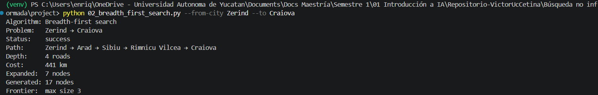
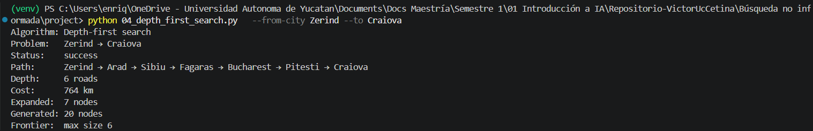
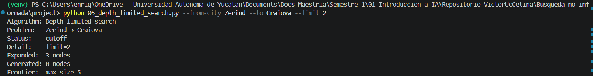
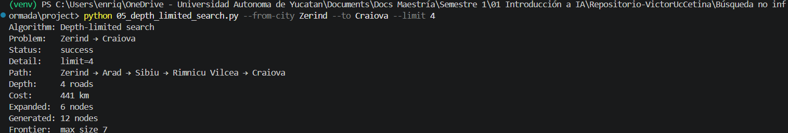
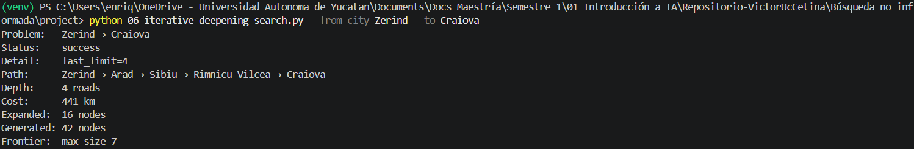

# Ejercicio 1 — Comparar BFS, UCS, DFS, DLS e IDS en el mapa de Rumania


### Algortimo realizado de las ciudades `Zerind` → `Craiova`



|          | Status   | Path     |Depth     |Cost      | Expanded
|:----------: |:-------- | :--------|:-------- |:-------- | :--------
| BFS |  Success |  Zerind → Arad → Sibiu → Rimnicu Vilcea → Craiova | 4 | 441 km | 7 nodes
| UCS | Success  | Zerind → Arad → Sibiu → Rimnicu Vilcea → Craiova | 4 | 441 km | 10 nodes
| DFS | Success  | Zerind → Arad → Sibiu → Fagaras → Bucharest → Pitesti → Craiova | 6 | 764 km | 7 nodes
| DLS (limit 2) | Cutoff | - | - | - | 3 nodes
| DLS (limit 4) | Success   | Zerind → Arad → Sibiu → Rimnicu Vilcea → Craiova | 4 |441 km | 6 nodes
| IDS | Success | Zerind → Arad → Sibiu → Rimnicu Vilcea → Craiova | 4 | 441 km | 16 nodes 




Los resultados de los algunoritmos fueron en su mayoría usando la ruta `Zerind` → Arad → Sibiu → Rimnicu Vilcea → `Craiova`, esta ruta consta de 4 carreteras (hops) pasando por 3 ciudades y acumulando un total de 441km, este camino es justamente el más corto en costo (km) para llegar a la ciudad objetivo, es por eso que UCS nos dio este resultado, al gual es el que implica usar menos carreteras (hops) solo se usan 4, es por eso que en esta ocasión BFS y UCS nos porporcionan el mismo resultado. Un ejemplo en el que esto no ocurre sería ir de `Sibiu` a `Bucharest`, hagamos el experimento: 

```bash
Algorithm: Breadth-first search
Problem:   Sibiu → Bucharest
Status:    success
Path:      Sibiu → Fagaras → Bucharest
Depth:     2 roads    #Notar que BFS nos da la solución que toma menos hops(carreteras)
Cost:      310 km
Expanded:  3 nodes
Generated: 9 nodes
Frontier:  max size 5
----
Algorithm: Uniform-cost search
Problem:   Sibiu → Bucharest
Status:    success
Path:      Sibiu → Rimnicu Vilcea → Pitesti → Bucharest
Depth:     3 roads
Cost:      278 km  #Notar que UCS nos da la solución con menos km (costo) aunque implique tomar más carreteras
Expanded:  9 nodes
Generated: 25 nodes
Frontier:  max size 6
```

La única solución que fue diferente es la del algoritmo DFS: `Zerind` → Arad → Sibiu → Fagaras → Bucharest → Pitesti → `Craiova`, sumando un total de 6 carreteras y 764km, es claro que no es una solución más óptima que la de los otros algoritmos, esto es debido a que el algoritmo **Depth-first search** profundiza en cada rama antes de retroceder e ir por las vecindades, en este caso las ramas se expanden y se exploran de forma alfabética, por lo que al pasar por `Sibiu` exploró primero la rama de Fagaras, siguiendo la misma regla, pasó por Bucharest, luego por Giurgiu (por el orden alfabético), pero al no ser el camino regresó y exploró Pitesti y finalmente llegó a Craiova y terminó. Al final para hallar su solución expandió 7 nodos al explorar Giurgiu. En conclusión DFS da una ruta más larga para el mismo gráfo porque al expandir los nodos en el orden alfabético llega al objetivo en en la primera y única rama expandida.

Analizando el resultado del algoritmo DLS, el `limit` que permitió hallar una solución fue a parti del 4, esto es debido a que el `limit` es la profundidad hasta la que busca el objetivo, si este se encuentra a una profundidad mayor entonces el algoritmo termina sin encontrar la solución (cutoff), la solución más corta corta se encuentra en profundidad 4. 


## Evidencias

### BFS


### UCS


### DFS


### DLS

-


### IDS 
