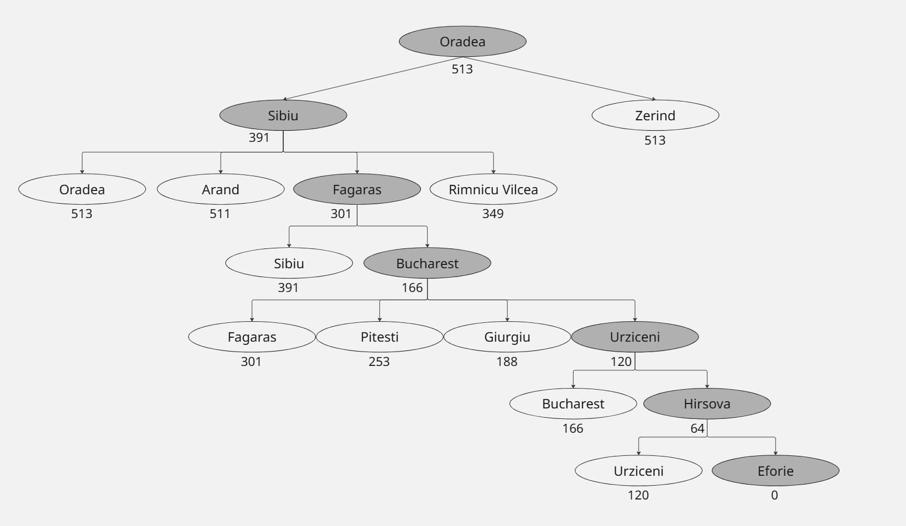
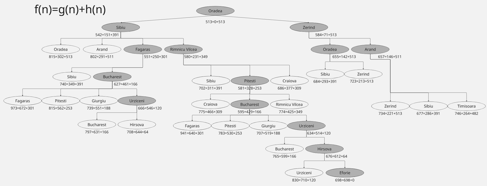
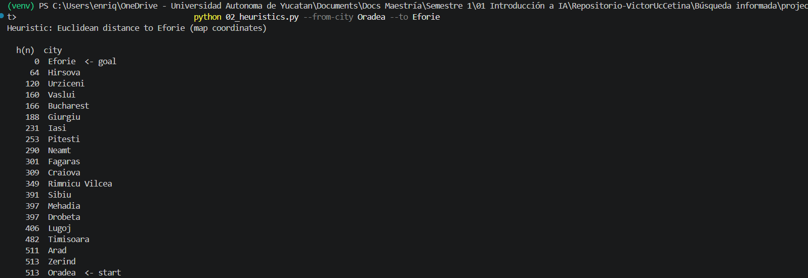
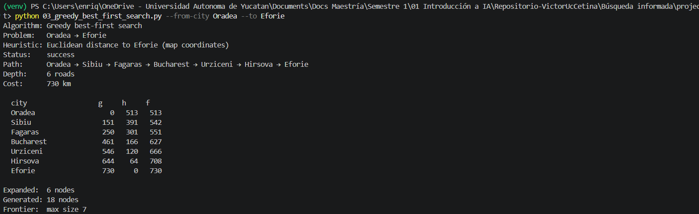
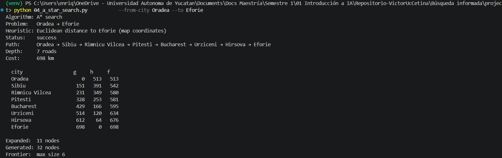

# Ejercicio 1 — Comparar Greedy y A* en el mapa de Rumania


## Ciudades elegidas para esta práctica:  `Oradea` → `Eforie`

A continuación exploramos la tabla de heuristic $h(n)$.
```bash
>> python 02_heuristics.py --from-city Oradea --to Eforie

Heuristic: Euclidean distance to Eforie (map coordinates)

  h(n)  city
      0  Eforie  <- goal
     64  Hirsova
    120  Urziceni
    160  Vaslui
    166  Bucharest
    188  Giurgiu
    231  Iasi
    253  Pitesti
    290  Neamt
    301  Fagaras
    309  Craiova
    349  Rimnicu Vilcea
    391  Sibiu
    397  Mehadia
    397  Drobeta
    406  Lugoj
    482  Timisoara
    511  Arad
    513  Zerind
    513  Oradea  <- start
```

Iniciando en `Oradea`, las vecindades son las ciudades `Zerind, h(n)=513` y ` Sibiu, h(n)=391`, por lo tanto el algoritmo Greedy Search expandirá primero la rama de `Sibiu` ya que es la que se acerca más al objetivo (de acuerdo con la distancia euclidiana al objetivo).
A continuación se presentan los resultados de ambos algoritmos: 

|  | Greedy Search | A* |
|:-------- |:---------|:--------|
|  Status  |  Success  |  Success  |
|  Path  | Oradea → Sibiu → Fagaras → Bucharest → Urziceni → Hirsova → Eforie  |  Oradea → Sibiu → Rimnicu Vilcea → Pitesti → Bucharest → Urziceni → Hirsova → Eforie  |
|  Depth  |  6 roads  |  7 roads  |
|  Cost  |  730 km  |  698 km  |
|  Expanded  |  6 nodes  |  11 nodes  |
|  Generated  |  18 nodes  |  32 nodes  |

- Como mencionamos, `Greedy Search` expande primero la rama que va a Sibiu, este algoritmo buscará expandir el camino que se acerque más rápido al objetivo sin considerar el costo en km que implique, solamente guiándose de la heurística $h(n)$ y expandiendo el nodo con la $h(n)$ más pequeña, este criterio de decisión hace que la cercanía al objetivo descienda drásticamente. 
- A diferencia , `A* Search` nos da una solución diferente debido a la función que utiliza para decidir que rama expandir. Este algorimo expandirá el nodo en el que $f(n)=g(n)+h(n)$ sea más pequeña, donde a la heurística se le agrega el costo de la ruta $g(n)$. Este cambio hace que el criterio $f(n)$ no decienda tan drásticamente al expandir un nodo (como en Greedy Search). Esto le permite al algoritmo explorar otras rutas que puede que no se acerquen tan rápidamente al objetivo en un inicio, pero a nivel de costo de ruta son más cortas. Esto también implicaría que este algoritmo utilice más recursos de memoria ya que crea y expande más nodos. 

## Diagramas

### Greedy Search 
 |city                 | g   |  h    | f
 |:-------- |:---------|:--------|:--------|
 | Oradea              |   0  | 513  | 513
 | Sibiu               |   151 |  391 |  542
 | Fagaras             |   250  | 301 |  551
 | Bucharest           |   461  | 166 |  627
 | Urziceni            |   546  | 120 |  666
 | Hirsova             |   644  |  64 |  708
 | Eforie              |   730  |   0 |  730

En el siguiente diagrama observamos como el algoritmo va expandiendo los nodos de acuerdo con la cercanía al objetivo utilizando el valor de la función de $h(n)$ : 
 


### A* Search
 |city                 | g   |  h    | f
 |:-------- |:---------|:--------|:--------|
 |Oradea                |   0 |  513  | 513
 |Sibiu                 | 151  | 391  | 542
 |Rimnicu Vilcea        | 231  | 349  | 580
 | Pitesti              |  328 |  253 |  581
 | Bucharest            |  429 |  166 |  595
 | Urziceni             |  514 |  120 |  634
 | Hirsova              |  612 |   64 |  676
 | Eforie               |  698 |    0 |  698

En el siguiente diagrama observamos como el algoritmo va expandiendo los nodos de acuerdo con la función $f(n)=g(n)+h(n)$, donde $g(n)$ es el costo acumulado de la ruta y la cercanía al objetivo utilizando el valor de la función de $h(n)$ : 



## Evidencias

### Heuristics


### Algoritmo Greedy_Search


### Algoritmo A* Search
