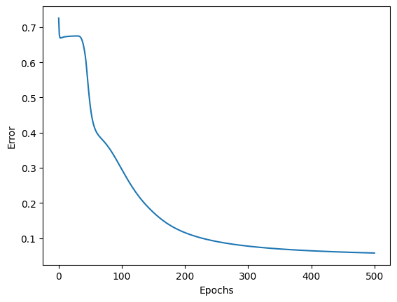
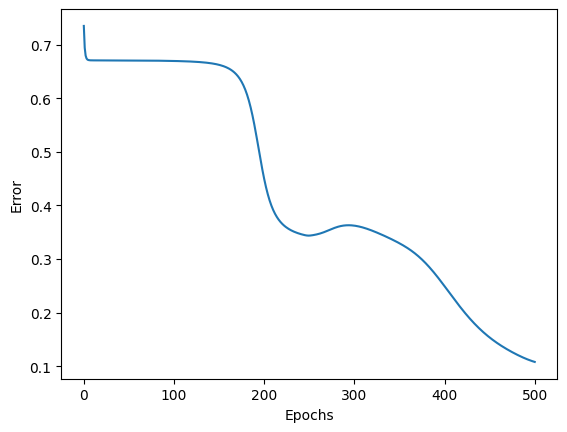
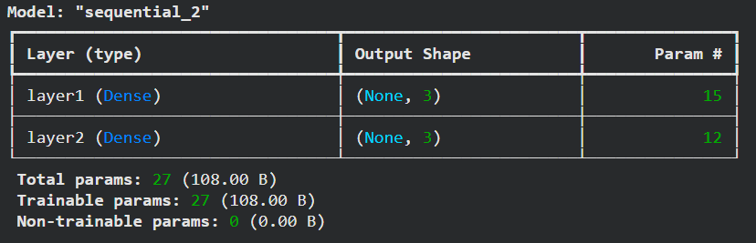
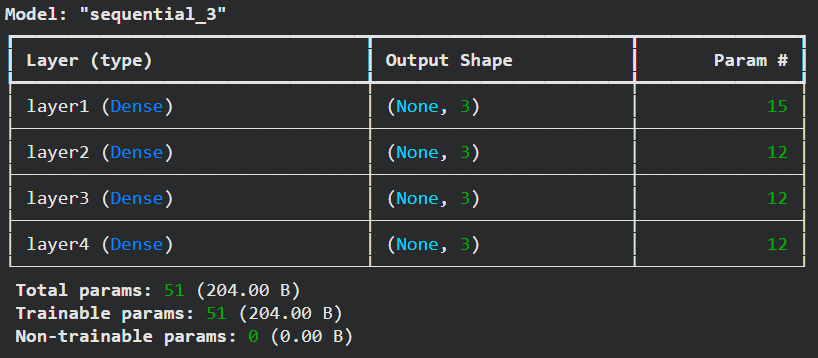
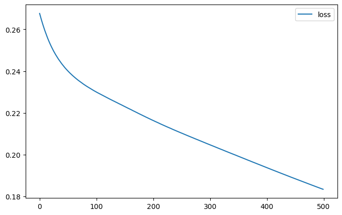
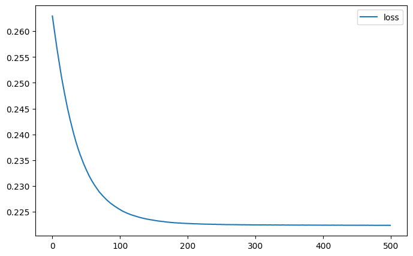
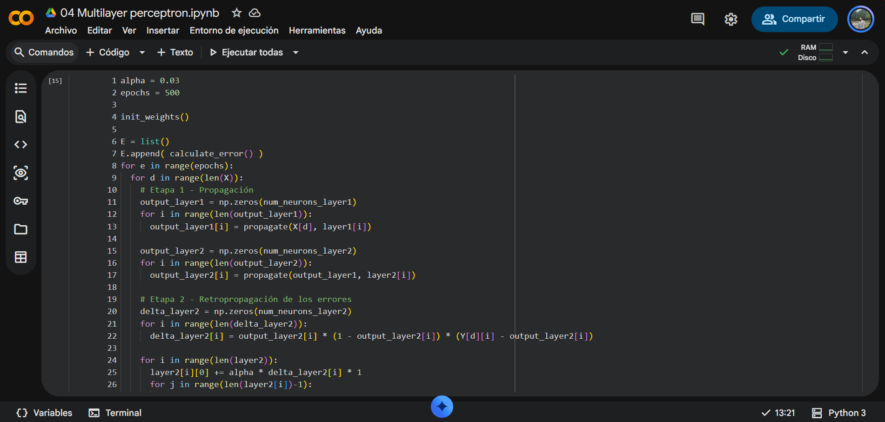
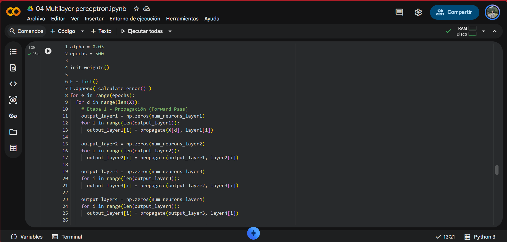
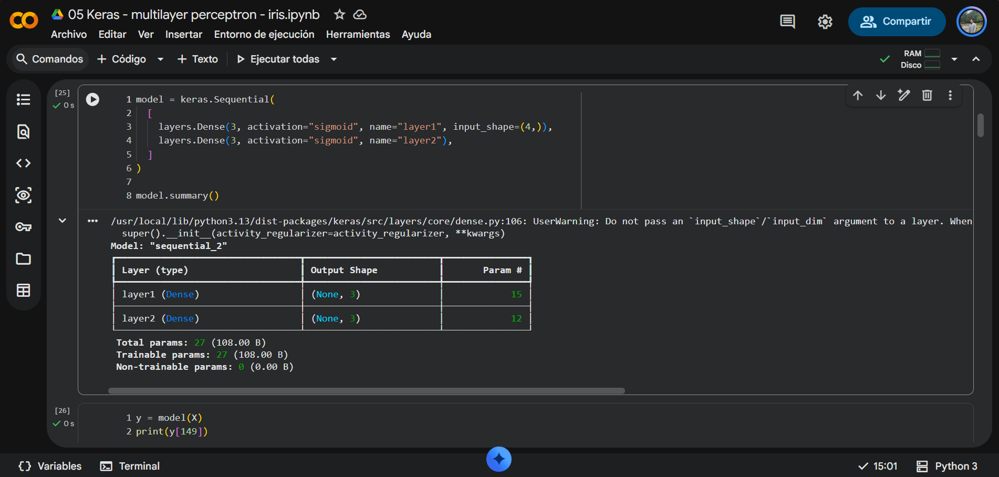
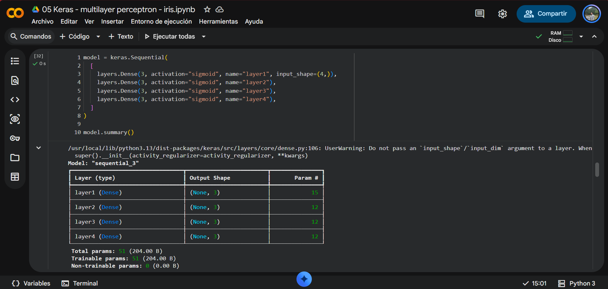

# Perceptrón multicapa en Iris Database

Enlaces:
 - Modelo implementado usando Numpy: https://drive.google.com/file/d/10MGivz0NEpCT03Zta-m_Omy5eByHNZjN/view?usp=sharing
 - Modelo implementado usando Keras: https://drive.google.com/file/d/1Z5Fwq57Cs6SUYrf3YvRt_RrTlp9FR1ZZ/view?usp=sharing 

En esta práctica usamos el modelo de perceptrón multicapa a la base de datos de Iris, inicialmente una arquitectura de 3 capas `4x3x3` y comparando los resultados utilizando una red más profunda de 5 capas `4x3x3x3x3`. 

| Numpy  |Original | Más profundo | 
|:-------- |:---------:| :---------:| 
|Arquitectura   | 4x3x3    | 4x3x3x3x3 | 
|Errors |  |  |
| Error final |  0.057428 | 0.673046 |

| Keras |Original | Más profundo | 
|:-------- |:---------:| :---------:| 
|Arquitectura   | 4x3x3    | 4x3x3x3x3 |
|model.summary() |  |  |
|Errors |  |  |
| Error final |  0.183468 | 0.222357 |

Observamos que para la base de datos de Iris, haber agregado 2 capas ocultas de neuronas adicionales no mejora el desempeño del modelo, podemos observar en el modelo implementado en Numpy que la tasa de cambio del error que se estanca y tiene una disminución menos pronunciada que el modelo original de 3 capas, es decir, aprender más rápido y con un mejor desempeño el modelo original, ya que al final de 500 épocas el error llegó a una cantidad más pequeña. El modelo implementado en Keras parece consistente en el resultado al alcanzar a disminuir el error hasta al rededor de 0.2, sin embargo el modelo más profundo parece llegar a ese nivel de error con menos épocas.

La principal razón por la que el desempeño no fue mejor con los modelos más profundos, es debido a que al usar la sigmoidal como función de activación de las neuronas, los gradientes para la actualización de los pesos cuando se hace la retroporpagación se vuelven cada vez más pequeños con forme agregamos más neuronas, por lo tanto esto hace que las neuronas de las primeras capas no se actualicen con la misma rapidez, y para llegar al mismo nivel de error que el modelo original al modelo más profundo le tomará más épocas.

También debemos considerar que la base de datos de Iris no es tan grande y las caracterísitcas de las flores se pueden identificar y separar de forma simple con modelos casi lineales, por lo tanto más capas implicaría más parámetros y puede probocar que el modelo se estanque en algún mínimo local, esto lo podemos observar cerca de la época 250 en la gráfica del modelo de Numpy, donde el error incluso empezó a incrementar. 

## Evidencias: 

### Modelo usando Numpy

### Modelo usando Keras

