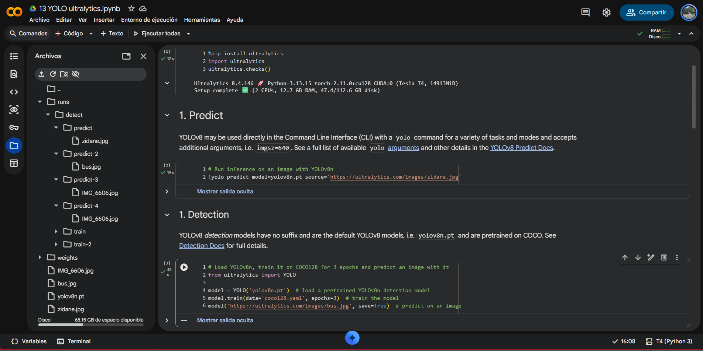
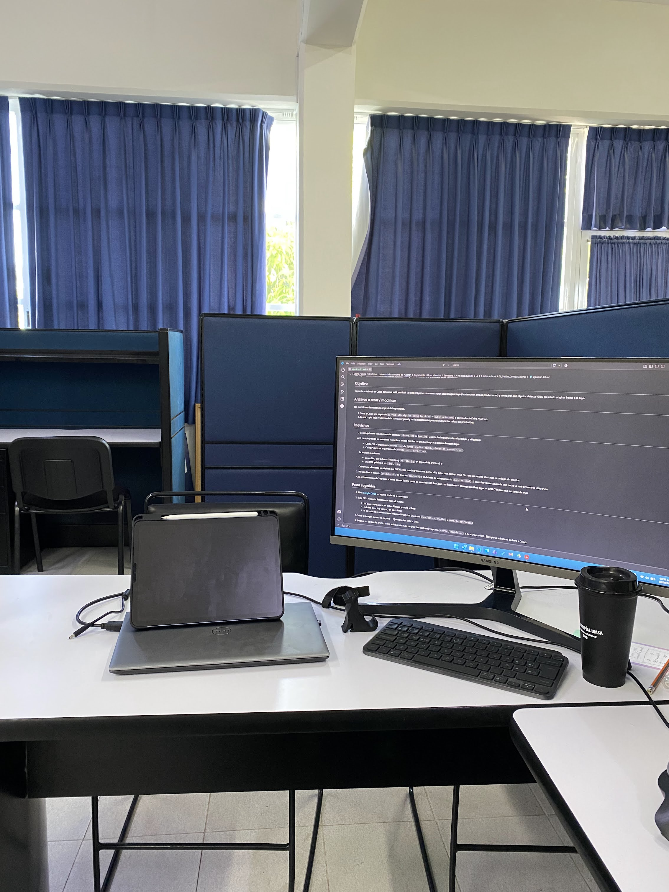
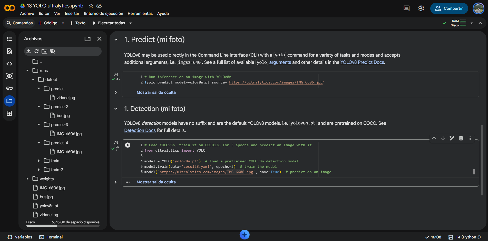

# Ejercicio 1 — Cambiar la imagen de predicción en YOLO

### Enlace a Notebook Colab 

https://drive.google.com/file/d/1TCKnO8MmkHc9JI-1Qu2Frl9V6GAICeo-/view?usp=sharing

## Predicciones originales

 

## Predicción en mi foto: 
    

### Objetos detectados por YOLO
- Fotos de Ultralytics: 
  - Persona
  - Corbata
  - Autobús 
  - Señal de alto
- Mi foto: 
  - Silla
  - Taza ** Aunque en mi foto es un vaso de café, es posible que en la base de entrenamiento le hayan pasado este tipo de recipientes como tazas. Aún así el nivel de confianza no es tan alto. 
  - Tv 
  - Laptop ** Notamos que identifica la laptop pero captura hasta el Ipad que se encuntra por encima, debido a que es muy similar a la pantalla de la laptop. 
  - Keyboard 

En el caso de mi foto, ambas celdas de predicción identifican los mismos objetos con un nivel de confianza similar. 
