# Ejercicio 1 — Separar los blobs y volver a elegir \(k\)

## Objetivo

Correr la notebook en Colab **tal como está**, anotar el \(k\) que sugieren
codo y silueta, **separar los 5 blobs** en el arreglo `blob_centers` (y, si
hace falta, `blob_std`) y volver a graficar. Debes ver si el codo y la
silueta se mueven hacia **\(k = 5\)**.

**Enlace a Google Colab**: https://drive.google.com/file/d/1Er3AeKpDGgUB9qRnT4vE_iYs79-RTa7G/view?usp=sharing
## Modificación de la posición de los blobs
Para modificar las nubes de puntos se utilizaron los siguientes centros y desviasiones estándar para obtener la muestra:
``` python
blob_centers = np.array(
    [[ -2.8,  2.4],
     [-2.2 ,  1.2],
     [-1,  1.5],
     [0.5,  2.8],
     [0.8,  1.1]])
blob_std = np.array([0.3, 0.25, 0.2, 0.3, 0.2])
```
El resultado de la modificación fue el siguiente: 
|  Original| Modificado | 
|:--- |:---- |
|  | |
|  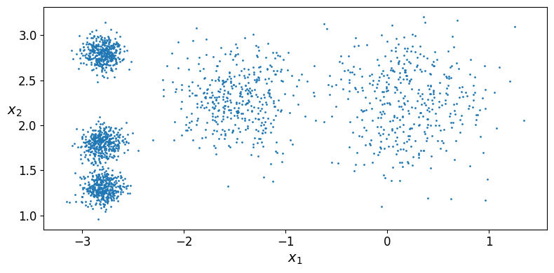 | 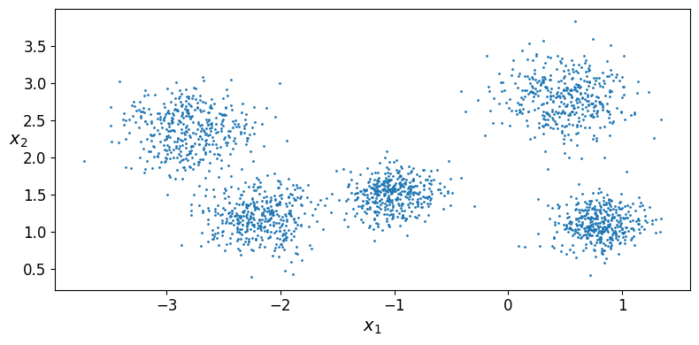| 

Las nubes de puntos modificadas deberían permitir que el algoritmo K-means pueda identificar de forma más clara los 5 centroides, ya que son nubes que no se traslapan y no se encuentran tan cerca una de la otra. 
Inicial mente corremos el algorimos con `k=5` y obtenemos la gráfica de Voronoi para identificar las zonas que el algoritmo determida para cada uno de los grupos:
|  Original| Modificado | 
|:--- |:---- 
|  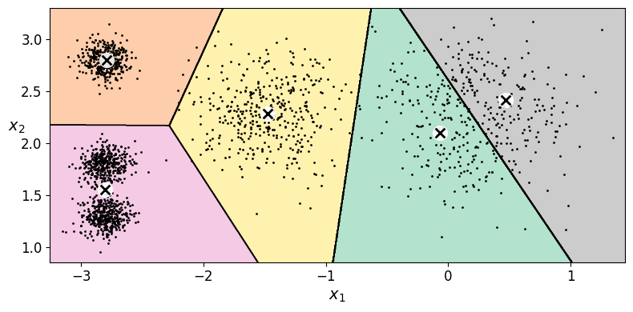 | 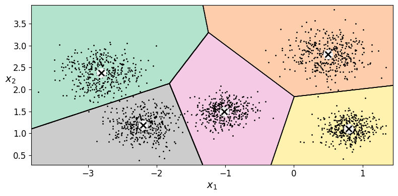 |
| Inertia: 224.0743    |  Inertia: 246.0926  |

Observamos que el algortimo de K-means identifica correctamente las 5 nubes de puntos en el ejercicios modificado, a diferencia del ejecicio original, el cambio de dejar una clara separación entre las nubes y una desviación no tan alta que evite que los puntos se traslapen entre sí hace que el algoritmo se desempeñe de forma eficiente. La inercia, que es la suma de cuadrados de las distancia de los puntos a sus centroides es similar, no podemos determinar si uno es mejor que otro con esta mética, ya que dependerá mucho de la dispersión de los puntos. En este ejercicio el modificado fue un poco mayor.

Ahora analizaremos si para el algoritmo `k=5` es suficiente, para esto observaremos la gráfica de inercias para cada valor de $k$. 

|  Original| Modificado | 
|:--- |:---- 
|  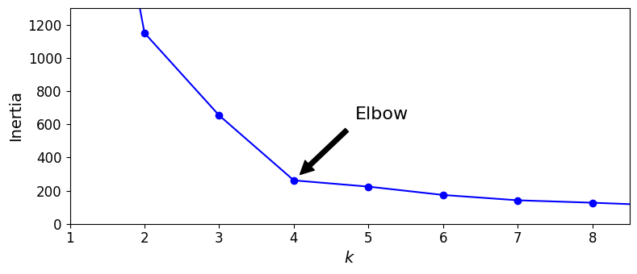 | 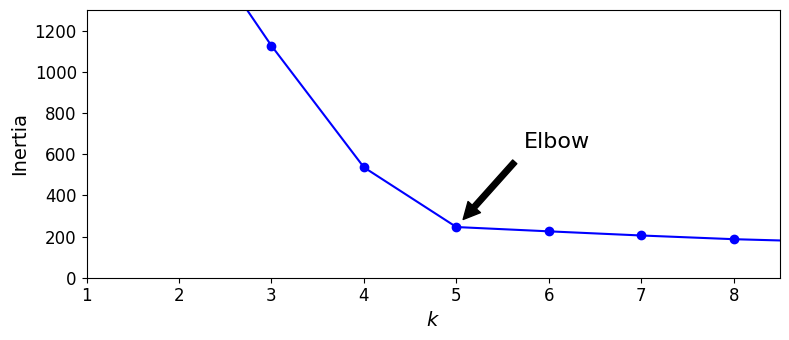 |

La idea es observar el "codo" que se forma en cada uno de las gráficas, porque buscamos el valor de $k$ que nos de un descenso de inercia más grande, en este ejemplo el modificado sugiere el mantener 5 grupos, mientras que el original sugiere solamente 4 grupos. 

En la siguiente tabla tenemos tabulados los valores de inercia del gráfico y los comparamos con la disminución de inercia respecto a $k-1$, es decir, vemos el descenso porcentual de considerar un grupo adicional:
<table>
    <thead>
        <tr>
            <th colspan="3">Original</th>
            <th colspan="3">Modificado</th>
        </tr>
        <tr>
            <th>k</th><th>Inertia</th><th>% Dif. respecto a k-1</th>
            <th>k</th><th>Inertia</th><th>% Dif. respecto a k-1</th>
        </tr>
    </thead>
    <tbody>
        <tr><td>1</td><td>3534.836087 </td><td>NaN</td><td>1</td><td>5195.749243</td><td>NaN</td></tr>
        <tr><td>2</td><td>1149.891350</td><td> 67.469741</td><td>2</td><td>1784.826390</td><td>65.648335</td></tr>
        <tr><td>3</td><td> 653.216719</td><td>43.193179</td><td>3</td><td>1126.469148</td><td>36.886346</td></tr>
        <tr><td>4</td><td>261.796778</td><td> 59.92191</td><td>4</td><td>535.997832</td><td>52.417886</td></tr>
        <tr><td>5</td><td>224.074331</td><td>14.409057</td><td>5</td><td>246.092635</td><td>54.087009</td></tr>
        <tr><td>6</td><td>173.876091 </td><td>22.402495</td><td>6</td><td>225.223499</td><td>8.480195</td></tr>
    </tbody>
</table>

Para el ejercicio original vemos que para $k=4$ la diferencia fue de 60%, mientras que considerar un grupo más, hace que el descenco de inercia sea solamente del 14% formando el codo en $k=4$. 

Para el ejercicio modificado considerando $k=5$ la diferencia fue del 54%, mientras que considerar un grupo adicional solamente hace que la inercia disminuya 8.4%, es decir, no aporta mucho considerar agregar un centroide más. 

Aunque en ambos casos los datos generados fueron usando 5 centros, el ejercicio original concluye que con 4 son suficientes, derivado de los 3 centros que tienen poca variabilidad y dos de ellos están ubicados muy cerca y los considera como uno solo, es por eso que agregar el centro adicional (el quinto) no hace una diferencia significativa de bajar la inercia (distancias a los centroides). 

-----
A continuación analizamos el Silhouette Score que es la media de los Silhouette Coeffients que se calculan como $$S\_Coeff = \frac{b-a}{max\{a,b\}}, \text{ a: mean inter-cluster distance ; b: mean nearest-cluster distance}$$
Con valores más cercanos al 1, indica que los datos fueron asignados al centroide más cercano o idóneo, valores cercanos al 0 indica que quedan en se mayoría cerca de las fronteras, y al -1 que no fueron asigandos al centroide más cercano o idóneo. 

Observamos que obtenemos el mismo resultado del análisis de inercias, el original sugiere $k=4$, mientras que el modificado sugiere considerar $k=5$ como óptimo. 
|  Original| Modificado | 
|:--- |:---- 
| 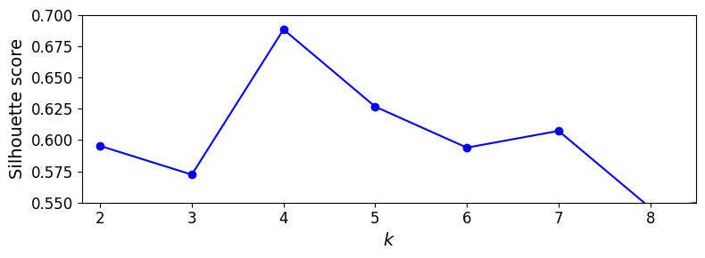  | 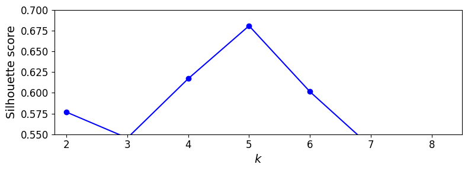|
| 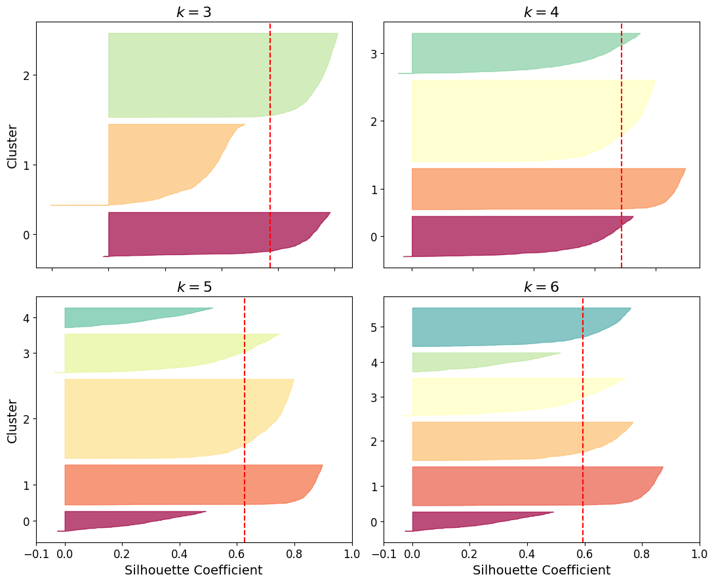 | 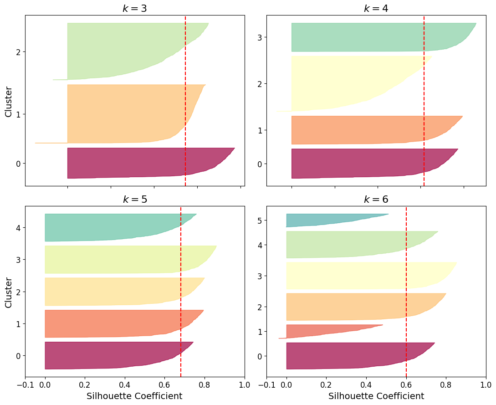 |

Analizando los Silhouette Scores por cluster observamos que para el ejercicio modificado el caso de $k=5$ es el que mejor desempeño tiene, ya que todas las barras tienen el mismo ancho y llegan a la línea que representa el Silhouette Score promedio. 

## Evidencias 
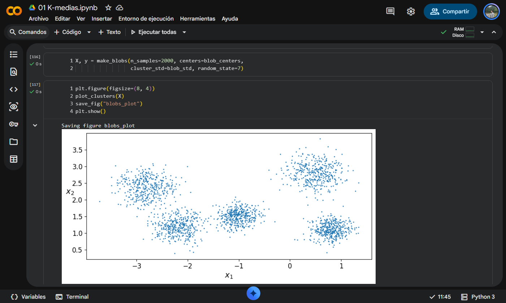

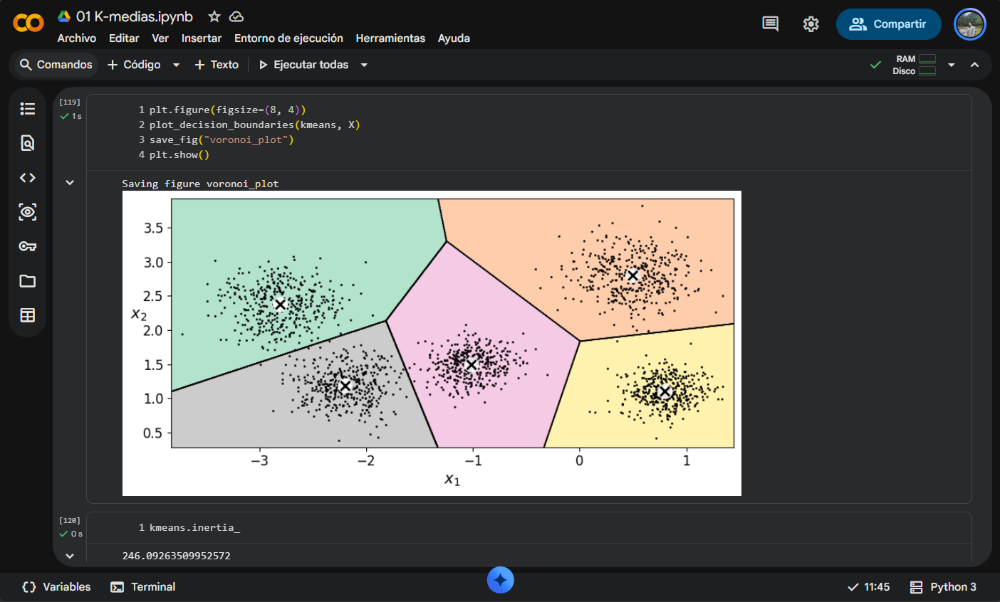

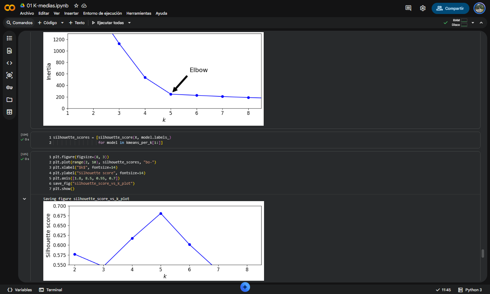