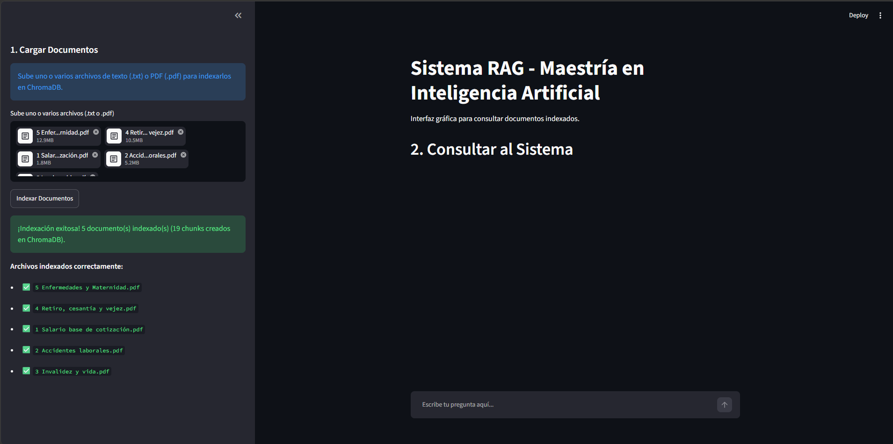
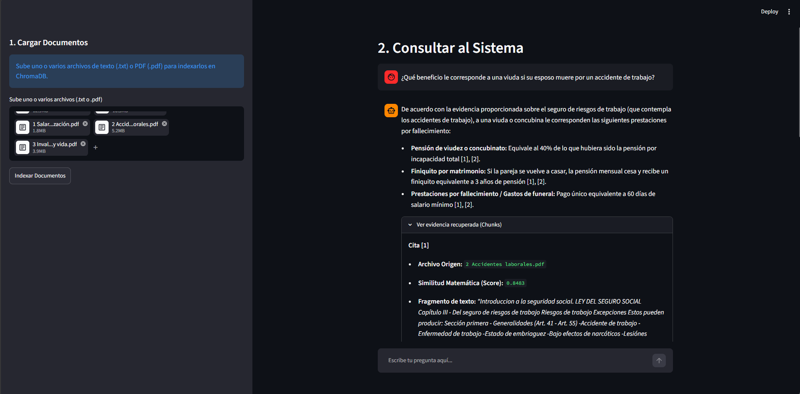
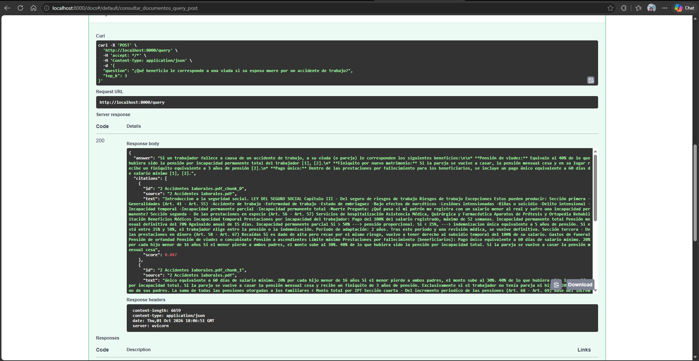
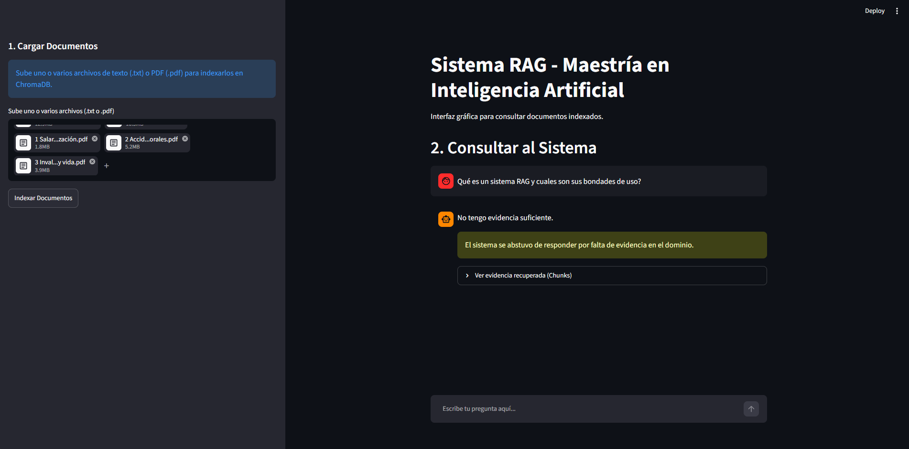

# Sistema RAG (Retrieval-Augmented Generation)

> **Proyecto Final — Introducción a la Inteligencia Artificial**  
> *Maestría en Inteligencia Artificial — Universidad Autónoma de Yucatán (UADY)*  
> **Tecnologías:** Streamlit | FastAPI | ChromaDB | Google AI (Gemini) | Python

---

## 1. Descripción del Proyecto

Este proyecto implementa un sistema de **Generación Aumentada por Recuperación (RAG)** que permite a los usuarios cargar e indexar documentos propios (en formatos `.pdf`, `.txt` o `.md`), formular preguntas en lenguaje natural y recibir respuestas en español ancladas a la evidencia recuperada de los documentos que el mismo usuario proporcionó, evitando alucinaciones y citando las fuentes de origen.

El flujo sigue el ciclo estándar de RAG:
```
Incrustar (Google AI) ➔ Indexar (ChromaDB) ➔ Recuperar Top-K ➔ Filtrar por Umbral ➔ Generar con Citas (Gemini)
```

---

## 2. Stack Tecnológico 

| Capa | Tecnología | Rol en el Sistema |
| :--- | :--- | :--- |
| **UI** | **Streamlit** (puerto `8501`) | Interfaz gráfica interactiva para cargar documentos, formular preguntas, visualizar respuestas con citas numeradas y explorar la evidencia con sus scores de similitud generados por el sistema. |
| **API** | **FastAPI** (puerto `8000`) | Servidor que orquesta la ingesta de archivos, el particionado, la vectorización en lotes y la consulta RAG. |
| **Índice Vectorial** | **ChromaDB** | Base de datos vectorial persistente en disco (`chroma/`) para almacenamiento de vectores y búsqueda de vecinos más cercanos. |
| **Embeddings** | **Google AI** (`gemini-embedding-001`) | Modelo de incrustación que transforma tanto los chunks de documentos como las preguntas en vectores de **3072 dimensiones**. |
| **Generación** | **Google AI** (`gemini-3.5-flash` / `gemini-3.6-flash`) | Modelo generativo que redacta la respuesta final en español citando la evidencia `[n]`, o se abstiene si no hay suficiente información. (Se agrega una opción para usar el modelo 3.6 en caso de alcanzar el límite de uso del 3.5, ya que se usa la versión gratuita de Google AI Studio) |
| **Lector PDF** | **`pypdf`** (`v6.19.0`) | Extracción de texto digital en memoria para archivos PDF con validación de documentos escaneados o protegidos. |

> **Principio de Arquitectura**: La interfaz de Streamlit **no** se comunica de manera directa con ChromaDB ni con Google AI. Toda interacción pasa a través de la API REST de FastAPI mediante peticiones HTTP JSON y Multipart.

---

## 3. Arquitectura del Sistema

```
Usuario
  └── Streamlit (puerto 8501)
        └── HTTP JSON
              └── FastAPI (puerto 8000) → La API es el puente entre el Usuario/Streamlit y la base de datos vectorial y Google AI. 
                    ├── Google AI  → embeddings 
                    ├── ChromaDB   → persistencia y k-NN
                    └── Google AI  → generación de la respuesta (Gemini)
```
---

## 4. Estructura de Archivos


### RAG-app/
- **.env.example**: Plantilla para la variable GOOGLE_API_KEY (En cuanto el usuario coloque la información, colocar en .gitignore, para no subir la información confidencial al repositorio).
- **.gitignore**: Exclusiones de Git (venv, .env, chroma, cache - Colocar los archivos locales que no son indispensables o información confidencial).
- **README.md**: Documentación completa y evidencias del proyecto.
- **requirements.txt**: Dependencias exactas del proyecto.

###  app/   

- **main.py**: Endpoints REST: /health, /ingest, /ingest-file, /query.
- **chunk.py**: Particionado en chunks con solape configurable.
- **embed.py**: Embeddings por lotes, control RPM y exponential backoff.
- **store.py**: Cliente de ChromaDB persistente en disco.
- **generate.py**: Generación con Gemini, umbral y abstención temprana.
- **pdf_utils.py**: Extracción y validación de texto en archivos PDF.

### ui/
- **streamlit_app.py**- Interfaz interactiva para carga de archivos (.txt, .pdf), chat, citas y scores.


---

## 5. Instalación y Configuración Paso a Paso

### 5.1 Prerrequisitos
- **Python 3.10** o superior instalado en el sistema.
- Una clave de API gratuita de **Google AI Studio**.

### 5.2 Obtención de la API Key
1. Ingresa a [Google AI Studio](https://aistudio.google.com/apikey).
2. Inicia sesión con tu cuenta de Google.
3. Haz clic en **"Create API key"** y copia la clave generada.

### 5.3 Clonar y Crear el Entorno Virtual

**En Windows (PowerShell o CMD):**
```bash
# Navegar a la carpeta del proyecto
cd RAG-app

# Crear el entorno virtual
python -m venv venv

# Activar el entorno virtual
venv\Scripts\activate

# Actualizar pip e instalar dependencias
python -m pip install --upgrade pip
pip install -r requirements.txt
```

**En macOS o Linux:**
```bash
# Navegar a la carpeta del proyecto
cd RAG-app

# Crear el entorno virtual
python3 -m venv venv

# Activar el entorno virtual
source venv/bin/activate

# Actualizar pip e instalar dependencias
pip install --upgrade pip
pip install -r requirements.txt
```

### 5.4 Configurar Variables de Entorno
Copia el archivo de ejemplo `.env.example` para crear tu `.env`:

**En Windows:**
```powershell
Copy-Item .env.example .env
```

**En Linux o macOS:**
```bash
cp .env.example .env
```

Abre el archivo `.env` con tu editor y coloca tu clave:
```env
GOOGLE_API_KEY=tu_clave_de_google_ai_aqui
```

---

## 6. Ejecución del Sistema

Para operar el sistema completo se requieren **dos terminales** simultáneas con el entorno virtual activado:

### Terminal 1: Servidor FastAPI
```bash
# Activar entorno si no está activo
venv\Scripts\activate   # (En Windows)
# source venv/bin/activate # (En macOS/Linux)

# Iniciar servidor Uvicorn en el puerto 8000
uvicorn app.main:app --reload --port 8000
```
- La API estará accesible en: `http://localhost:8000`
- Documentación interactiva Swagger UI: `http://localhost:8000/docs`

### Terminal 2: Interfaz Streamlit
```bash
# Activar entorno si no está activo
venv\Scripts\activate   # (En Windows)
# source venv/bin/activate # (En macOS/Linux)

# Iniciar la aplicación web de Streamlit
streamlit run ui/streamlit_app.py
```
- La interfaz abrirá automáticamente en tu navegador en: `http://localhost:8501`

Para detener cualquiera de los dos servicios, presiona `Ctrl + C` en la terminal correspondiente.

---

## 7. Documentación de Endpoints (FastAPI)

FastAPI expone endpoints completamente documentados y testeables vía `/docs`:

### 1. `GET /health`
Verifica la disponibilidad de la API.
- **Respuesta `200 OK`**:
  ```json
  {
    "status": "ok",
    "message": "La API está viva y funcionando"
  }
  ```

### 2. `POST /ingest`
Recibe uno o varios documentos en formato JSON para chunkificar, vectorizar en lotes consolidados e indexar en ChromaDB.
- **Body JSON (Monodocumento o Multidocumento)**:
  ```json
  [
    {
      "nombre_archivo": "redes_neuronales.txt",
      "contenido_texto": "Texto completo del documento a indexar..."
    },
    {
      "nombre_archivo": "procesamiento_lenguaje.txt",
      "contenido_texto": "Texto completo del segundo documento..."
    }
  ]
  ```
  *(También admite un único objeto JSON `{ "nombre_archivo": "...", "contenido_texto": "..." }`).*
- **Respuesta `200 OK`**:
  ```json
  {
    "mensaje": "Indexación exitosa",
    "documentos_indexados": 2,
    "chunks_indexados": 8,
    "archivos_exitosos": ["redes_neuronales.txt", "procesamiento_lenguaje.txt"],
    "archivos_omitidos": []
  }
  ```

### 3. `POST /ingest-files` & `POST /ingest-file`
Reciben archivos físicos (`.pdf`, `.txt`, `.md`) mediante `multipart/form-data`. `/ingest-files` admite subir múltiples documentos simultáneamente.
- **Form Data**: `files` (uno o varios archivos binarios).
- Extrae el texto digital en memoria (utilizando `pypdf` para documentos PDF o decodificación UTF-8/Latin-1 para texto).
- **Tolerancia a fallos**: Procesa e indexa todos los archivos válidos e informa en `archivos_omitidos` aquellos que estén vacíos o escaneados (sin texto OCR).
- **Respuesta `200 OK`**:
  ```json
  {
    "mensaje": "Indexación exitosa",
    "documentos_indexados": 2,
    "chunks_indexados": 5,
    "archivos_exitosos": ["investigacion.pdf", "resumen.txt"],
    "archivos_omitidos": [
      {
        "nombre": "escaneado.pdf",
        "motivo": "El archivo PDF no contiene texto legible (posible documento escaneado)."
      }
    ]
  }
  ```

### 4. `POST /query`
Recibe una pregunta y el parámetro opcional `top_k` de vecinos a recuperar.
- **Body JSON**:
  ```json
  {
    "question": "¿Cuándo inició la guerra de independencia de México?",
    "top_k": 3
  }
  ```
- **Respuesta `200 OK`**:
  ```json
  {
    "answer": "La guerra por la independencia mexicana comenzó el día 16 de septiembre de 1810 [1].",
    "citations": [
      {
        "id": "historiademexico.txt_chunk_0",
        "source": "historiademexico.txt",
        "text": "La guerra por la independencia mexicana comenzó el día 16 de septiembre de 1810...",
        "score": 0.7784
      }
    ],
    "abstained": false
  }
  ```

---

## 8. Reporte Técnico de Decisiones de Diseño

### 8.1 Estrategia de Particionado (Chunking)
- **Implementación**: `chunk_text(text, chunk_size=300, overlap=50)` en [app/chunk.py]
- **Tamaño del chunk**: 300 palabras (~400 tokens). Proporciona suficiente contexto conceptual sin diluir la información específica en un párrafo excesivamente extenso.
- **Solape (*Overlap*)**: 50 palabras. Evita la pérdida de contexto en los límites de cada fragmento, asegurando que frases que conectan dos ideas contiguas no queden cortadas entre chunks consecutivos.

### 8.2 Conversión de Distancia a Similitud Matemática
Por defecto, ChromaDB utiliza la distancia euclidiana al cuadrado ($L_2^2$). Dado que los embeddings de Google AI (`gemini-embedding-001`) poseen norma unitaria ($\|u\|_2 = 1$), la distancia $L_2^2$ se relaciona directamente con la similitud coseno mediante la fórmula:
$$\text{Similitud Coseno} = 1 - \frac{d_{L2}^2}{2}$$

En [app/main.py], cada distancia devuelta por ChromaDB se transforma a una escala de similitud matemática en $[0, 1]$:
```python
distancia = resultados['distances'][0][i] if 'distances' in resultados and resultados['distances'] else 2.0
score = round(max(0.0, 1.0 - (distancia / 2.0)), 4)
```
Esto asegura que un valor cercano a `1.0` signifique alta relevancia semántica, facilitando la comprensión del usuario en la UI y la aplicación de umbrales.

### 8.3 Criterio y Umbral de Abstención
El sistema incorpora un doble mecanismo de abstención para evitar alucinaciones:
1. **Abstención Temprana por Umbral de Score**:
   - Se estableció un umbral de similitud mínima de **`0.65`** (`UMBRAL_MINIMO_SCORE = 0.65`).
   - Si ningún fragmento recuperado de ChromaDB alcanza una similitud $\ge 0.65$ (o no se recuperó evidencia), la función `generar_respuesta` en [app/generate.py] **se abstiene de forma inmediata sin realizar ninguna llamada a la API de Gemini**, devolviendo `"No tengo evidencia suficiente."` y marcando `abstained: true`.
   - Si algunos fragmentos superan el umbral y otros no, se filtran para incluir en el prompt únicamente los fragmentos que satisfacen el umbral.
2. **Abstención a Nivel de Modelo**:
   - Si los fragmentos superan el umbral pero el contenido no responde la pregunta planteada, las instrucciones estrictas del prompt ordenan al modelo responder exactamente con la frase `"No tengo evidencia suficiente."`, impidiendo el uso de conocimiento paramétrico o la invención de datos.

### 8.4 Optimización de Cuotas RPM de Google AI Studio
La capa gratuita de Google AI impone un límite estricto de **15 peticiones por minuto (RPM)**. Para garantizar estabilidad durante la ingesta de documentos largos se implementó:
- **Embeddings por Lotes (*Batching*)**: Se implementó `get_embeddings_batch` en [app/embed.py], agrupando hasta **20 fragmentos por petición**. Un documento de 40 chunks se indexa en solo 2 llamadas HTTP en lugar de 40.
- **Pausa Preventiva**: Se incluye una pausa de `1.5` segundos entre lotes sucesivos para dosificar la tasa de transferencia.
- **Retroceso Exponencial (*Exponential Backoff*)**: Ante un eventual error `429 RESOURCE_EXHAUSTED`, el sistema espera $5 \times 2^i$ segundos (5s, 10s, 20s) y reintenta automáticamente hasta 4 veces.
- **Fallback de Generación**: En [app/generate.py], si `gemini-3.5-flash` experimenta saturación temporal (`503 UNAVAILABLE`), el sistema conmuta de forma transparente al modelo alternativo `gemini-3.6-flash`.

Con estas implementaciones se logra una mejor optimización de uso de los recursos gratuitos de Google AI Studio, aunque se castiga un poco con tiempos de espera más largos para la indexación, todo dependiendo de la extensión de los documentos que subamos como base de conocimiento para responder las preguntas. 

---

## 9. Corpus de Prueba

El corpus de prueba utilizado pertenece a presentaciones sobre los cinco capítulos de la **Ley del Seguro Social** del 2026, estas presentaciones fueron parte del seminario del Curso de **Introducción a la Seguridad Social** de la Licenciatura en Actuaría de la UADY. 

1. `1 Salario base de cotización`: Determina los componentes que integran los salarios bases de cotización en México, importantes para determinar las cuotas y a la cuantía de los beneficios a los que puede acceder un trabajador formal. 
2. `2 Accidentes laborales`: Detalla la cobertura del seguro de accidentes laborales, indicando la cuantía de la indemnización por enfermedad, invalidez y seguro de vida, por perjuicios relacionados con actividades propias del trabajo. 
3. `` 3 Invalidez y vida``: Detalla la cobertura del seguro de Invalidez y el seguro de vida para todos los trabajadores, atribuidos a perjuicios que no se relacionan con actividades laborales. 
4. ``4 Retiro, cesantía y vejez``: Detalla la cuantía del seguro de jubilación, es decir, la cuantía de la pensión que alcanzaría del trabajador al alcanzar la edad de retiro bajo las normas de la Ley de 1973 (tabuladores) y la operación de la Reforma de 1997 y del 2022, así como las opciones que tienen los trabajadores para disponer del recurso.
5. ``5 Enfermedades y maternidad``: Detalla la cobertura de enfermedades y maternidad que aplica para el trabajdor y sus beneficiaros (cónyuge y familiares directos), explica los beneficios en servicios médicos y en especie otorgados, así como períodos de espera y reglas de operación de los beneficios de maternidad.

### Preguntas de Prueba Sugeridas:
- **Dentro de dominio 1**: *"Cuántos días y que beneficios le corresponden por maternidad a las trabajadoras?"* 

``` bash
De acuerdo con la evidencia proporcionada, los días y beneficios que les corresponden a las trabajadoras por concepto de maternidad son los siguientes:
 - Duración y flexibilidad de días: El subsidio por maternidad tiene una duración de 84 días (42 previos y 42 posteriores al parto) [1]. Existe la flexibilidad de transferir hasta 4 semanas previas para utilizarlas después del parto [1].
 - Beneficio económico (Subsidio): Consiste en el 100% del último salario diario de cotización, requiriendo como condición haber cotizado al menos 30 semanas en los últimos 12 meses [1].
 - Asistencia médica y obstétrica: Reciben asistencia obstétrica durante el embarazo, alumbramiento y puerperio [2]. Asimismo, se brinda atención obligatoria por urgencias obstétricas, sean o no derechohabientes [2].
 - Apoyo para la lactancia:
      - Ayuda en especie por lactancia durante 6 meses [2].
      - Descansos de 2 reposos de 30 minutos o 1 descanso de 1 hora al día para amamantar o extraer leche [1], [2].
 - Otros beneficios: Entrega de una canastilla al nacer el hijo [1], [2].
```
Citas:

``` bash
Cita [1]

Archivo Origen: 5 Enfermedades y Maternidad.pdf
Similitud Matemática (Score): 0.8726
Fragmento de texto: "52 semanas adicionales (previo dictamen médico). Duración: Hasta 52 semanas por el mismo padecimiento (padecimiento no profesional).. Descansos: 2 reposos de 30 min. o 1 descanso de 1 hora al día para amamantar o extraer leche. Entrega de una canastilla al nacer el hijo. Beneficios Económicos - Enfermedades (Arts. 96-100, 104) Subsidio por Enfermedad: 60% del último salario diario de cotización. Condición: Mínimo 4 cotizaciones semanales previas. Inicio de pago: A partir del cuarto día de incapacidad. 06 Ayuda de Gastos de Funeral: Equivalente a 2 meses de salario mínimo general, aproximadamente $18,000. Beneficios Económicos - Maternidad (Arts. 101 - 103) 07 Subsidio por Maternidad: 100% del último salario diario de cotización. Duración: 84 días (42 previos y 42 posteriores al parto). Requisito: 30 cotizaciones semanales en los últimos 12 meses. Flexibilidad (Art. 102 Bis): Transferencia de hasta 4 semanas previas para después del parto. Sistema de Financiación (Arts. 88, 105 - 108) Financiamiento Tripartito: Patrones, Trabajadores y Gobierno Federal. Especie: Cuota patronal base (13.9% de 1 SM) + Cuotas adicionales patronal/obrera si el salario rebasa 3 veces el SM. Dinero: Cuota del 1% sobre el Salario Base (70% patrón, 25% obrero, 5% Estado). Capital Constitutivo (Art. 88): Multa al patrón por no asegurar al trabajador. 05 Conservación de Derechos (Arts. 109 - 111 A) 12 Conservación de Derechos: 8 semanas de cobertura médica posterior a la pérdida del empleo (requiere 8 cotizaciones previas). Declaración Especial de Ausencia: Protección a familiares de personas desaparecidas. Expediente Clínico Electrónico (ECE): 1.Validez legal equivalente a la firma autógrafa. 2.Estricta confidencialidad de datos. Medicina Preventiva (Art. 110 - 111) 11 Proteger la salud y evitar la aparición de enfermedades o discapacidades. ¿Qué hace el IMSS?: Programas de comunicación para la salud. Campañas de vacunación. Análisis epidemiológicos para entender enfermedades. Apoyo para recuperar capacidades tras"
Cita [2]

Archivo Origen: 5 Enfermedades y Maternidad.pdf
Similitud Matemática (Score): 0.8565
Fragmento de texto: "Equipo 3 De la Vega Arcos, Sharon Dzul Chan, Jaydi Daniela López Garma, Mónica Andrea Pérez Gutiérrez, Stephany Thayli Tejero Lopez, Miroslava de los Ángeles Valenzuela Torres, Guadalupe de Jesus Seguro de Enfermedades y Maternidad Contenido 03 04 Sujetos Amparados Reglas Generales y Certificación 05 Prestaciones en Especie 06 Beneficios Económicos 08 Sistema de Financiación 09 Conservación de Derechos Sujetos Amparados (Art. 84) 03 Asegurado(a) y Pensionado(a). Cónyuge, concubino(a) o pareja en unión civil. Hijos menores de 16 años (o hasta 25 si estudian). Hijos con discapacidad (sin límite de edad). Padres que vivan y dependan del asegurado. Reglas Generales y Certificación (Arts. 85 - 90) 03 Certificación: El IMSS determina el inicio de la enfermedad o el estado de embarazo. Obligación médica: El paciente debe acatar los tratamientos; de lo contrario, se suspenden beneficios. Prestación de servicios (Art. 90): Directa, indirecta (subrogación) o convenios de colaboración. Urgencias Obstétricas (Art.89): Atención obligatoria, sean o no derechohabientes (es una medida vital para combatir la mortalidad materna.) Conservación de derechos (Art 86.): Si un trabajador es dado de baja, él y sus beneficiarios conservan el derecho a recibir atención médica de maternidad y enfermedades durante las 8 semanas posteriores a la baja, siempre que haya cotizado al menos 8 semanas ininterrumpidas antes de salir. Maternidad (Arts. 94 - 95) Enfermedades (Arts. 91 - 93) Asistencia obstétrica durante embarazo, alumbramiento y puerperio. Lactancia: Ayuda en especie por 6 meses. Prestaciones en Especie 04 Cobertura: Asistencia médico-quirúrgica, farmacéutica y hospitalaria. Prórroga: Posibilidad de extender 52 semanas adicionales (previo dictamen médico). Duración: Hasta 52 semanas por el mismo padecimiento (padecimiento no profesional).. Descansos: 2 reposos de 30 min. o 1 descanso de 1 hora al día para amamantar o extraer leche. Entrega de una canastilla al nacer el hijo. Beneficios Económicos - Enfermedades (Arts. 96-100,"
Cita [3]

Archivo Origen: 2 Accidentes laborales.pdf
Similitud Matemática (Score): 0.8181
Fragmento de texto: "Introduccion a la seguridad social. LEY DEL SEGURO SOCIAL Capítulo III - Del seguro de riesgos de trabajo Riesgos de trabajo Excepciones Estos pueden producir: Sección primera - Generalidades (Art. 41 - Art. 55) -Accidente de trabajo -Enfermedad de trabajo -Estado de embriaguez -Bajo efectos de narcóticos -Lesiónes intensionadas -Riñas o suicidio -Delito intensional -Incapacidad temporal -Incapacidad permanente parcial -Incapacidad permanente total -Muerte Pregunta: ¿Qué pasa si mi patrón me registra con un salario menor al real y sufro una incapacidad permanente? Sección segunda - De las prestaciones en especie (Art. 56 - Art. 57) Servicios de hospitalización Asistencia Médica, Quirúrgica y Farmacéutica Aparatos de Prótesis y Ortopedia Rehabilitación Beneficios Médicos Incapacidad temporal Prestaciones por incapacidad del trabajador: Pago del 100% del salario registrado, máximo de 52 semanas. Incapacidad permanente total Pensión mensual definitiva del 70% Aguinaldo anual de 15 días. Incapacidad permanente parcial Si > 50% ---> pensión proporcional. Si < 25%, ---> indemnizacion única equivalente a 5 años de pensión. Si está entre 25% y 50%, el trabajador elige entre la pensión o la indemnización. Periodo de adaptación: 2 años. Tras este periodo y una revisión médica, se vuelve definitiva. Sección tercera - De las prestaciones en dinero (Art. 58 - Art. 67) Recaídas Si es dado de alta pero recae por el mismo riesgo, vuelve a tener derecho al subsidio temporal del 100% de su salario. Gastos de funeral Pensión de orfandad Pensión de viudez o concubinato Pensión a ascendientes Límite máximo Prestaciones por fallecimiento (beneficiarios): Pago único equivalente a 60 días de salario mínimo. 20% por cada hijo menor de 16 años Si el menor pierde a ambos padres, el monto sube al 30%. 40% de lo que hubiera sido la pensión por incapacidad total. Si la pareja se vuelve a casar la pensión mensual cesa"
```

- **Dentro de dominio 2**: *"¿Qué beneficio le corresponde a una viuda si su esposo muere por un accidente de trabajo?"* 
``` bash
De acuerdo con la evidencia proporcionada sobre el seguro de riesgos de trabajo (que contempla los accidentes de trabajo), a una viuda o concubina le corresponden las siguientes prestaciones por fallecimiento: 
- Pensión de viudez o concubinato: Equivale al 40% de lo que hubiera sido la pensión por incapacidad total [1], [2]. 
- Finiquito por matrimonio: Si la pareja se vuelve a casar, la pensión mensual cesa y recibe un finiquito equivalente a 3 años de pensión [1], [2]. 
- Prestaciones por fallecimiento / Gastos de funeral: Pago único equivalente a 60 días de salario mínimo [1], [2].
```

Citas: 

``` bash
Cita [1]

Archivo Origen: 2 Accidentes laborales.pdf
Similitud Matemática (Score): 0.8483
Fragmento de texto: "Introduccion a la seguridad social. LEY DEL SEGURO SOCIAL Capítulo III - Del seguro de riesgos de trabajo Riesgos de trabajo Excepciones Estos pueden producir: Sección primera - Generalidades (Art. 41 - Art. 55) -Accidente de trabajo -Enfermedad de trabajo -Estado de embriaguez -Bajo efectos de narcóticos -Lesiónes intensionadas -Riñas o suicidio -Delito intensional -Incapacidad temporal -Incapacidad permanente parcial -Incapacidad permanente total -Muerte Pregunta: ¿Qué pasa si mi patrón me registra con un salario menor al real y sufro una incapacidad permanente? Sección segunda - De las prestaciones en especie (Art. 56 - Art. 57) Servicios de hospitalización Asistencia Médica, Quirúrgica y Farmacéutica Aparatos de Prótesis y Ortopedia Rehabilitación Beneficios Médicos Incapacidad temporal Prestaciones por incapacidad del trabajador: Pago del 100% del salario registrado, máximo de 52 semanas. Incapacidad permanente total Pensión mensual definitiva del 70% Aguinaldo anual de 15 días. Incapacidad permanente parcial Si > 50% ---> pensión proporcional. Si < 25%, ---> indemnizacion única equivalente a 5 años de pensión. Si está entre 25% y 50%, el trabajador elige entre la pensión o la indemnización. Periodo de adaptación: 2 años. Tras este periodo y una revisión médica, se vuelve definitiva. Sección tercera - De las prestaciones en dinero (Art. 58 - Art. 67) Recaídas Si es dado de alta pero recae por el mismo riesgo, vuelve a tener derecho al subsidio temporal del 100% de su salario. Gastos de funeral Pensión de orfandad Pensión de viudez o concubinato Pensión a ascendientes Límite máximo Prestaciones por fallecimiento (beneficiarios): Pago único equivalente a 60 días de salario mínimo. 20% por cada hijo menor de 16 años Si el menor pierde a ambos padres, el monto sube al 30%. 40% de lo que hubiera sido la pensión por incapacidad total. Si la pareja se vuelve a casar la pensión mensual cesa"
Cita [2]

Archivo Origen: 2 Accidentes laborales.pdf
Similitud Matemática (Score): 0.8429
Fragmento de texto: "único equivalente a 60 días de salario mínimo. 20% por cada hijo menor de 16 años Si el menor pierde a ambos padres, el monto sube al 30%. 40% de lo que hubiera sido la pensión por incapacidad total. Si la pareja se vuelve a casar la pensión mensual cesa y recibe un finiquito de 3 años de pensión. Exclusivamente si el trabajador no tenía pareja ni hijos. 20% a cada uno de sus padres. La suma de todas las pensiones otorgadas a los familiares < Monto total por IPT Sección cuarta - Del incremento periodico de las pensiones (Art. 68 - Art. 69) Base del incremento Mes de actualización Beneficiarios incluidos La cuantía de las pensiones por incapacidad permanente se actualiza anualmente en el mes de febrero. El aumento se calcula conforme al INPC del año calendario anterior. Básicamente, se ajustan conforme a la inflación para que no pierdan su poder adquisitivo. Aplica exactamente igual para todas las pensiones otorgadas a los familiares por riesgos de trabajo. Financiamiento 100% patronal Inscripción inicial Revisión anual Todas las prestaciones, capitales constitutivos y gastos administrativos de este seguro se cubren exclusivamente con las cuotas de los patrones. Sección quinta - Del regimen financiero (Art. 70 - Art. 79) Al registrarse por primera vez o cambiar de giro, las empresas pagan una "Prima Media" dependiendo de su clase de riesgo. Cada año la empresa revisa su siniestralidad. Su prima puede subir o bajar un máximo de 1% respecto al año anterior. Donde: V = 28 años, que es la duración promedio de vida activa de un individuo que no haya sido víctima de un accidente mortal o de incapacidad permanente total. F = 2.3, que es el factor de prima. N = Número de trabajadores promedio expuestos al riesgo. S = Total de"
Cita [3]

Archivo Origen: 3 Invalidez y vida.pdf
Similitud Matemática (Score): 0.8421
Fragmento de texto: "Restricciones (no aplica el derecho) Suspensión del derecho No seguir tratamiento médico No acudir a evaluaciones del IMSS Recuperación del trabajador Beneficios en caso de fallecimiento Se otorgan a los beneficiarios: Pensión a ascendientes Apoyo económico adicional (ayuda asistencial) Atención médica Pensión de viudez Pensión de orfandad para beneficiarios Requisitos El asegurado debe tener al menos 150 semanas cotizadas La muerte no debe derivar de riesgo de trabajo beneficiarios Apoyo a Pensión de viudez Pensión a ascendientes Para hijos: Menores de 16 años Hasta 25 si estudian También aplica en caso de incapacidad Monto: 20% o 30% de la pensión Aplica si no existen: Cónyuge Hijos Se otorga a padres dependientes Monto: 20% de la pensión Se otorga a: Cónyuge o concubino(a) Monto: 90% de la pensión Termina si: Se contrae matrimonio o concubinato Pensión de orfandad Asignaciones familiares Apoyos adicionales: 15% al cónyuge 10% por cada hijo Puede incluir ayuda asistencial Se otorgan según dependientes económicos Cálculo de la pension 35% del salario promedio Considera las últimas 500 semanas Se actualiza conforme a la inflación Incluye asignaciones familiares Límites de la pensión No puede exceder del 100% del salario promedio Se distribuye entre beneficiarios Se ajusta anualmente Financiamiento del seguro Se financia con aportaciones de: Trabajador Patrón Estado Lo que se conoce como sistema tripartito Conservación de derechos Al dejar de cotizar se conservan derechos por un tiempo Depende del historial de cotización Se pueden recuperar al reingresar Conclusión El Seguro de Invalidez y Vida es fundamental para la protección económica del trabajador Garantiza ingresos cuando existe incapacidad o fallecimiento Protege también a los beneficiarios mediante pensiones y apoyos Funciona con un sistema basado en aportaciones del trabajador, patrón y Estado Es clave para la estabilidad social y económica"
```

- **Pregunta fuera de dominio (Abstención)**: *"Qué es un sistema RAG y cuales son sus bondades de uso?"* 
 ```
 "No tengo evidencia suficiente."
 ```

---

## 10. Evidencias de Funcionamiento


### Indexación de los documentos


---

### Evidencia 1: Consulta RAG Exitosa con Citas y Scores en Streamlit
*Captura de pantalla de la interfaz de Streamlit (puerto 8501) mostrando la respuesta generada por Gemini a una pregunta del corpus, acompañada de sus citas numeradas `[n]` y el desplegable con la evidencia recuperada (archivo de origen, score de similitud matemática y texto del chunk).*




---

### Evidencia 2: Consulta Idéntica en la API de FastAPI (`/docs` o `curl`)
*Captura de pantalla de la misma consulta formulada a través de la documentación interactiva Swagger UI (`http://localhost:8000/docs`) o mediante terminal (`curl`/Postman), mostrando la respuesta HTTP 200 con el JSON conteniendo `answer`, `citations` con scores, y `abstained: false`.*


### Evidencia 3: Pregunta Fuera de Dominio con Abstención del Sistema
*Captura de pantalla mostrando una pregunta sobre un tema inexistente en el corpus (ejemplo: "¿Cuál es la receta de la pizza napolitana?"). Se evidencia que el sistema no alucina información, muestra la advertencia de abstención en Streamlit y devuelve `"No tengo evidencia suficiente."`.



---


